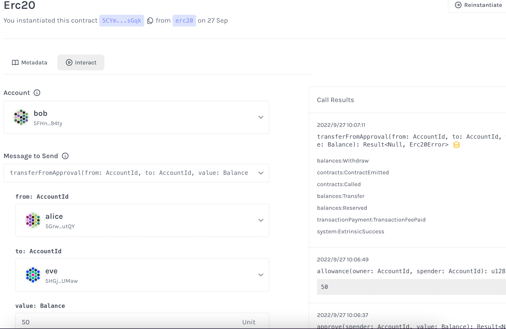

#

## 安装指定版本 cargo-contract

```
cargo install cargo-contract --git https://github.com/paritytech/cargo-contract.git --tag v2.0.0-alpha.3 --force --locked --
```

## 作业

- 自己完成并部署一个erc20的智能合约

### 测试合约

`make t_contract`

结果:

```
running 7 tests
test erc20::tests::transfer_fails ... ok
test erc20::tests::total_supply_works ... ok
test erc20::tests::transfer_from_approval_fail ... ok
test erc20::tests::new_works ... ok
test erc20::tests::transfer_works ... ok
test erc20::tests::balance_of_works ... ok
test erc20::tests::transfer_from_approval_works ... ok

test result: ok. 7 passed; 0 failed; 0 ignored; 0 measured; 0 filtered out; finished in 0.00s

```

### 编译合约

`make b_contract`

- 可能很慢或者失败,原因 github.com 需要代理加速

结果

```
- erc20.contract (code + metadata)
- erc20.wasm (the contract's code)
- metadata.json (the contract's metadata)
```

### 启动 contracts node

`make r_node`

## 部署&测试合约内容

- [合约浏览器](https://contracts-ui.substrate.io/)
- 
