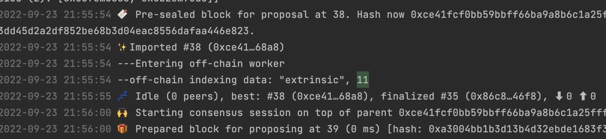
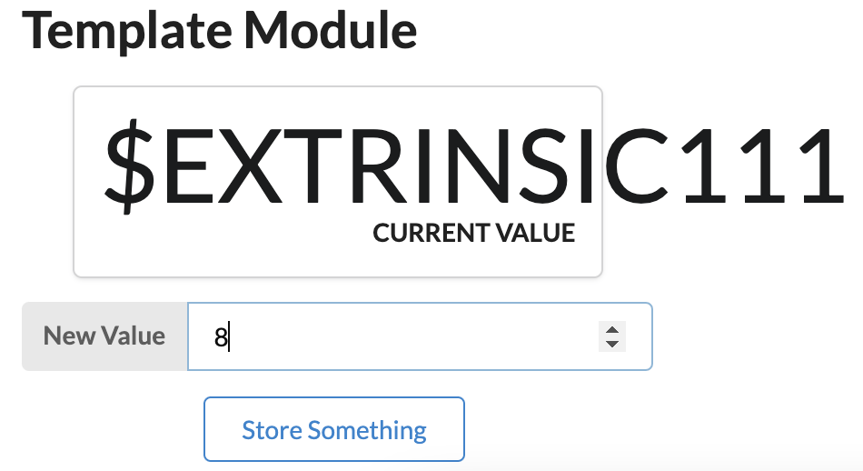

# 课程4作业

1. 在 Offchain Worker 中，使用 Offchain Indexing 特性实现从链上向 Offchain Storage 中写入数据
    - 主目录中运行 `make r`
    - 
2. 使用 js sdk 从浏览器 frontend 获取到前面写入 Offchain Storage 的数据
    - 启动浏览器 `make fr`
    - 输入你提交的 block_number 数字后看结果
    - 
3. 回答链上随机数（如前面Kitties示例中）与链下随机数的区别
    - 链上随机数
        - 基于来自先前 81块的块哈希生成低影响随机值。
        - 在防御相对较弱的对手时，低影响随机性可能很有用。
        - 建议将此托盘用作随机源，主要用于测试等安全性较低的情况。
    - 链下随机数
        - 是由主机环境生成的真正随机、不确定的种子。
        - 链下工作节点无法得知他人生成的随机数。

## 可选的下周作业之前补上...

1. （可选）在 Offchain Worker
   中，解决向链上发起不签名请求时剩下的那个错误。参考：https://github.com/paritytech/substrate/blob/master/frame/examples/offchain-worker/src/lib.rs
2. （可选）构思一个应用场景，描述如何使用 Offchain Features 三大组件去实现它
3. （可选）如果有时间，可以实现一个上述原型