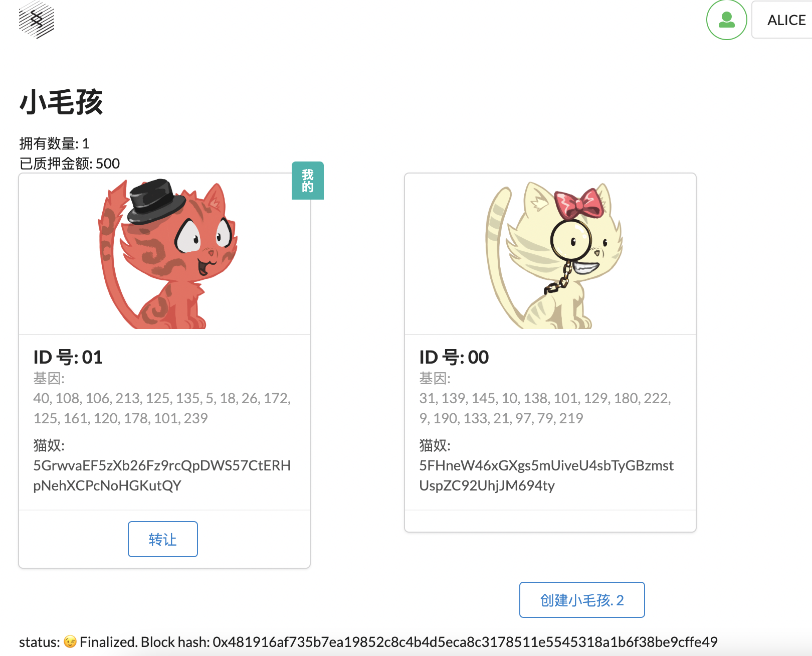

# kitties

## 测试

- 服务器启动 `make server`
- 客户端启动 `make client`

第三课作业:

1. Pallet Kitties 的单元测试，尽量覆盖所有的方法和错误
2. 基于 Poldadot js 的 UI 开发，通过前端可以和链完成交互
3. 前端模版: https://github.com/SubstrateCourse/advance-5

- 可以创建一只小猫
- 每一个小猫展示成一张卡片,并显示属于不属于自己
- 可以转让小猫给别人
- 查看自己拥有的小猫数量

## 测试截图

## 运行截图

