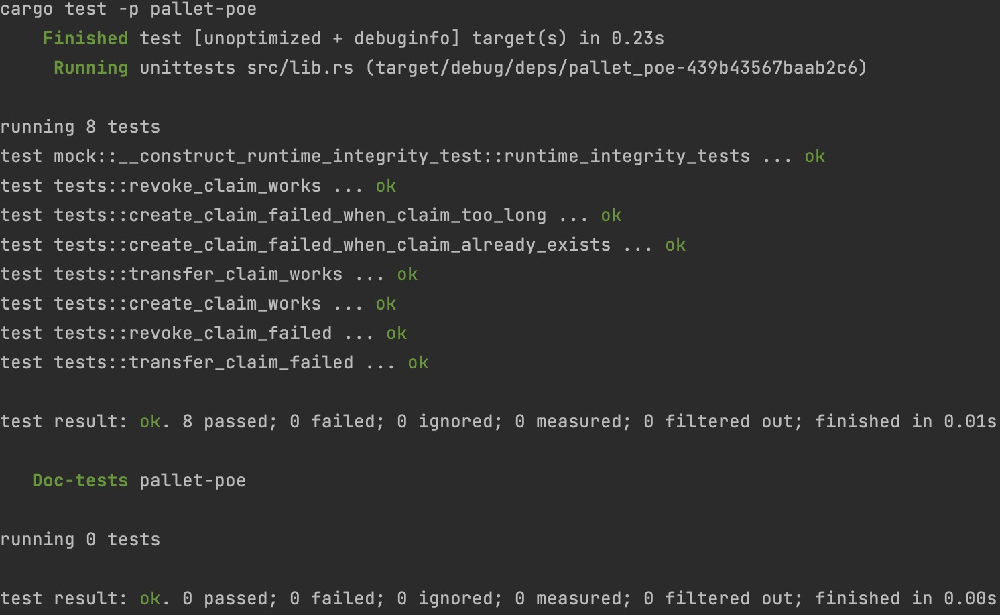
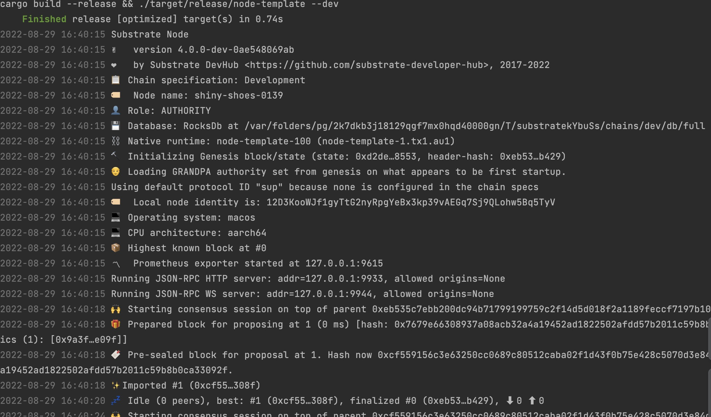

# oneblock substrate course

oneblock 进阶系列课程作业仓库

## poe 文件存证代码以及测试用例

1. [调度函数代码地址](https://github.com/hello-substrate/oneblock-substrate-course/blob/1-1-poe/pallets/poe/src/lib.rs#L74)
2. [测试函数地址](https://github.com/hello-substrate/oneblock-substrate-course/blob/1-1-poe/pallets/poe/src/tests.rs#L7)

## 测试运行截图

## 项目运行截图

