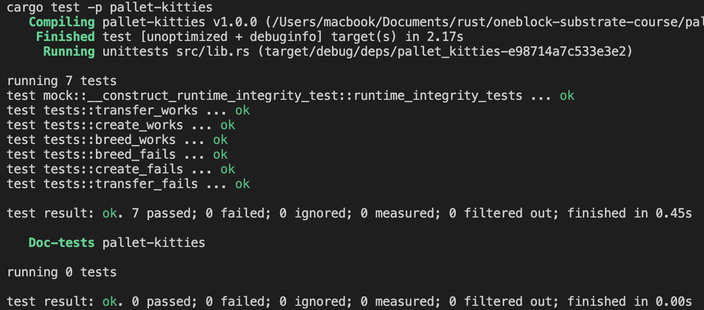
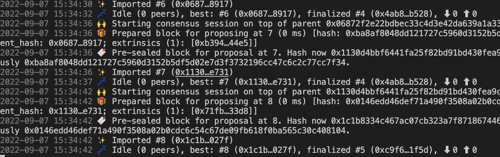

# kitties
第三课作业:
1. Pallet Kitties 的单元测试，尽量覆盖所有的方法和错误
2. 基于Poldadot js 的UI 开发，通过前端可以和链完成交互 
3. 前端模版: https://github.com/SubstrateCourse/advance-5

- 可以创建一只小猫
- 每一个小猫展示成一张卡片,并显示属于不属于自己
- 可以转让小猫给别人

## 测试截图

## 运行截图

